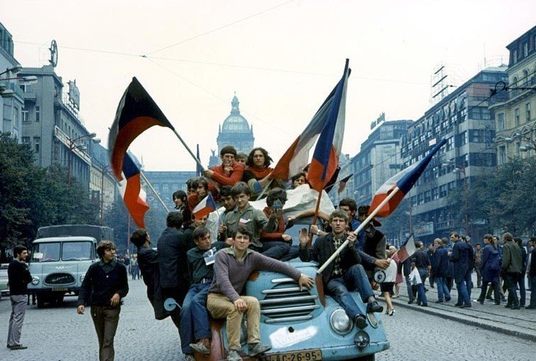
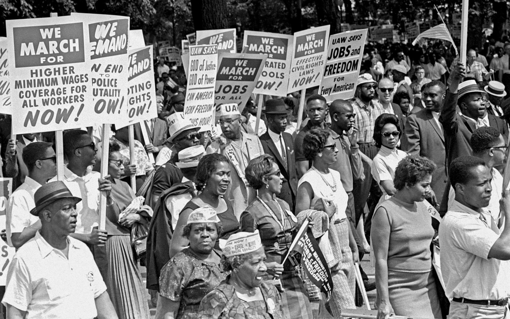
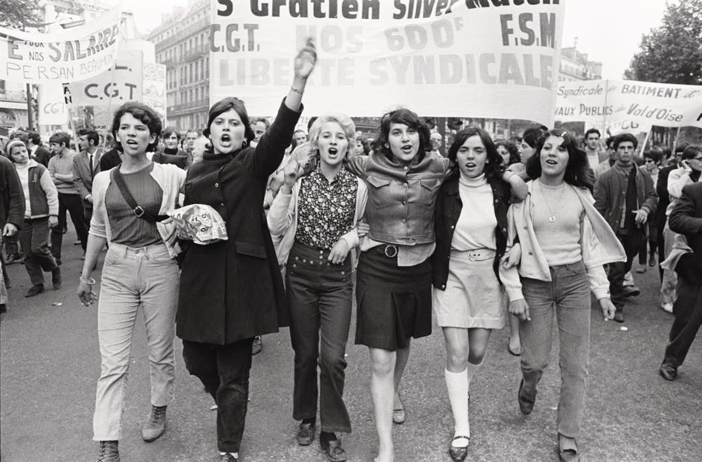

Doesn’t something about this year feel familiar? Everything that we thought was definite is now in doubt, the future draped in a weighted blanket so as to muffle the hum of little hopes on the horizon; of a long summer or a family gathering, reducing what once was a surging crescendo to a tinny whimper.
 
Yet, there is *something* (that lies beyond description as always) that reeks of familiarity.

Mark Twain famously said that history doesn’t repeat itself, but it does rhyme. If humankind is destined to make the same mistakes over and over again, that could go a long way to explaining where we’ve seen this all before.
 
Walking past the radio where it plays an incessant loop of roughly five pop songs, I pause. The usual 4 by 4 beat has been replaced with something else. Is this Cat Stevens I’m hearing? The propulsive reggae-infused chords of Maxi Priest’s 1987 cover of “Wild World” bump towards me. This song appears to be playing at least three times a day on what is otherwise an eternal cascade of the most mind-numbing cultural rot imaginable.

This strikes me because the radio doesn’t typically represent a bastion of relatability for me. Especially in these “unprecedented” times. While we are battling COVID, racism and Trumpism, the songs on the radio continue to wax sappy about love, lust, and not going back to your ex, the “I’m stronger now” rhetoric so desensitising that it almost doesn’t register. So to be quite literally stopped in my tracks by a different song – an old song, the jaunty tune telling my childhood self about the tribulations of the world out there - was galvanising. But the lack of variety in the songs charting right now, the absence of subject matter exploring socially salient themes, is very telling. And streaming, charts, and radio – the very foundations of the music industry – are to blame.   
 
What we hoped would be a reprise of the roaring 20s has morphed away from dreams of decadence and towards something more akin to the jarring realism immediately following the 1960s. While hippies never had to obsess over the intricacies of student debt, the climate emergency or a deadly virus cycling through the Greek alphabet, there remain many parallels between our world today and the harsh realities of their time. It only takes a slight breeze, but in 2020 a tornado of societal turmoil revealed the ugly machinations of our institutions and their corrupting influence on our daily lives. The smokescreen, which was lifted internationally for the first time in 1968, has revealed capitalism and imperialism once again as the root of all problems.

Infamously, the insidious intentions of US involvement in the Vietnam War were laid bare for the world to see when Vietnamese troops began to rebel in the Tet Offensive of 1968. The carefully crafted illusion of American might in a foreign war was shattered to reveal the shards of genocide and the pilfering of a foreign economy and livelihoods. The great farce of America was laid bare, and nobody liked what they saw. Civilians seized upon the arresting mood of people power and took to the streets to demonstrate against the inbred culture of hate and capitalism.

Though 68’ was the year it came to a head for many, in 1965 people were already resonating with song lyrics that critiqued America’s hand in international crises. Barry McGuire’s “Eve of Destruction” became the bestselling record of the year in the US, introducing pessimism to the traditionally sanctified ground of the Top Forty – a space concerned with Itsy Bitsy Teenie Weenie Yellow Polka Dot Bikinis, and similar artefacts. By this time, people believed music to be a powerful opinion-forming device. “Eve’s” profound realism and widespread resonance had conservatives rushing to ban it, lest it ring true to even more than it already had. Undeniably, its presence in the charts granted legitimacy to anti-capitalist sentiment in the mainstream, while the furore around its airplay encouraged listeners to engage critically with the song and form an opinion for themselves. The chart’s internal feedback loop of flaccid doo-wop and Middle American complacency was broken.

Across the ocean in 1968, socialist reform in Czechoslovakia was quashed by Soviet forces during the Prague Spring. Increases in freedom of speech, decentralisation of the economy and democratisation were reversed. Then, the May 68’ protests in France commenced with university students and factory workers striking in the name of increased personal freedoms, an end to the class divide, and better working conditions. Never had a civil protest evolved into something so closely resembling a civil war. It completely halted the French economy before petering out after the resignation of the French president, reeling the country back from the cusp of revolution.

When revolution couldn’t be experienced on the streets, it could be felt through song. And nobody put pen to paper better than Bob Dylan. Timothy Hampton, professor in comparative literature and author of the 2019 book, *Bob Dylan’s Poetics*, discusses how Dylan’s emergence into the charts required him to develop “a new poetic [vocabulary](https://www.jstor.org/stable/10.1525/rep.2015.132.1.1) and link it to the limited formal capacities of the popular song.” When Dylan’s husky notes crackled out through the transistor radio, it was this “ethical vocabulary” that allowed listeners to comprehend the lyrics within their context and engage critically with the song. But if it took the great Bob Dylan rethinking the entire backbone of his songs to get airtime, it remains to be seen whether modern artists will be successful in winning over the increasingly homogenised charts. In an age where commercials are king, Michael Bublé is doing a radio ad (an auditory medium) for TikTok (a visual medium) to a demographic of over 25’s. For every song we hear we also have to know about a slight variation to the McDonald’s menu or be subjected to a miserable car insurance jingle. An anti-capitalist song cannot exist comfortably alongside the heavy-handed inclusion of commercials for big business. As long as this moral paradox exists, protest songs will never experience longevity in the charts or on the radio.

So, music was powerful, but the medium was just as important. While the Top Forty remained an uncomfortable home for truthful music, the streets were calling out for melodies. When protest and song came together, it created a potent tonic for the hard done by, giving not only musicality but common rhetoric to a movement. In 1968 the Civil Rights Movement came to an uncertain end with the assassination of Martin Luther King Jr and the signing of the Civil Rights Act. Singed into cultural memory is a chorus of people, harmonising to songs about “black bodies swingin' in the Southern breeze,” “hound dogs on my trail,” and “school children sitting in jail.” Popular perception of the Civil Rights Movement as a peaceful protest comes down to music’s ability to unite people under a cause, granting them another tool to forge ahead in the pursuit of a better life.

It’s the stuff history classes are made of, but in the two short years since the dawn of the 2020s, we could well be living in the reprise of 1968. It began with the international mobilisation of students who acted upon collective desperation to resolve the climate emergency. Strike action called upon big business and the fossil fuel industry to commit to meaningful change. Then came the COVID-19 pandemic which uncovered the uglier parts of our most embedded systems. Our imperialist default continues to disproportionately affect the quality of health care and infection rates amongst indigenous and ethnic minorities, while the climate crisis indelibly affected these same communities. While COVID ramped up, George Floyd was killed at the hands of police officers, sparking international protests against the continued systemic racism directed towards people of colour globally. Two years on and the dust is still whirling around the crisis as we face up to the insidiousness of capitalism, all the while grappling with our own consumer ideals and their consequences in the modern world. Then Russia invaded Ukraine, the plight of Ukrainians renewing global anger about America’s hand in international conflicts, both in Europe and the Middle East. 
 
If the late 60s was the era of the protest, it was also the era of the protest song. More obvious anti-insanity titles included Country Joe and the Fish’s “Feel-Like-I’m-Fixin-To-Die Rag,” while others took more poetic approaches like in Sam Cooke’s “A Change Is Gonna Come” or Bob Dylan’s “The Times They Are A-Changin.’” What could be classified as protest songs today are absent from the charts and from playlisting on streaming services, meaning they fly below the radar at the time that they are needed most. In a 1977 article written for the [New York Times](https://www.nytimes.com/1977/06/05/archives/the-style-of-the-70s-pop-culture-pop.html), Greil Marcus encapsulated the spirit of the 70s with two Rolling Stones songs; “Gimmie Shelter” and “You Can’t Always Get What You Want.” These songs portrayed the uncertainty of the time in a new light, making it seem “dramatic and vital, a new field of action and a new test of nerve.”
 
That kind of nerve is what we need right now. Back then, music was the medium. People would travel to gigs, meet with others and form a movement that way. Today, while we’re shut down, distanced, isolated, and other depressing adverbs, social media is often the medium. But the message stays the same. Power to the people, the people got the power. Our nerve has truly been tested in the two short years since the start of this decade. The end of the world looms large. For the second time in history, we have awoken to the evils of capitalism and faced up to rampant institutionalised and weaponised racism. Additionally, we are contending with the ceaseless destruction of the natural environment.
 
But the ever-increasing commercialisation of music and the false sense of its democratisation has led to a Top 40 largely devoid of the music that people need. Most songs’ repetitive, watered-down lyrics hint at a vague idea of freedom, without offering the opportunity for listeners to reflect or examine their own relationship to that message. 

Nowhere does this play out more allegorically than on the radio. Traditionally a symbol for the transference of information, in the hands of corporate music behemoths the radio has become yet another stain upon the human condition, psychologically perpetuating the cycle of audio junk that reaches our ears daily. iHeartMedia’s “On The Verge” program has been credited with the widespread success of songs like Iggy Azalea’s interminable “Fancy.” [The Washington Post](https://www.washingtonpost.com/news/arts-and-entertainment/wp/2014/07/15/clear-channels-on-the-verge-program-helped-make-iggy-azalea-a-star-heres-how-it-works/) reported that the program hones in on a pool of 6 new songs chosen from hundreds by those at the top of the hierarchy. From there they are forwarded to radio programmers who pick the up-and-comer that they think will be most successful on their station. The song is then broadcast a minimum of 150 times in six weeks across 860 radio stations with over 237 million listeners per month. By the time a bad pop song has burrowed its way into your synapses it’s already too late - you’re singing it to yourself in the shower. And that is a sacred space. Songs are not on the radio because they are popular, they are popular because they are on the radio. It is a simple tactic of manipulation that has us believing a song that has climbed an algorithm, shimmied through the radio and into the charts is a good song. Until we stop confounding the familiarity of a song with taking an active liking to it, we will continue to fulfil the prophecies constructed by corporations. 
 
With most music consumed via streaming sites, the landscape of listening has changed for the worse. What we have been led to believe is an impartial service which makes all music available to everyone, actually carefully programs the discoverability of certain songs and artists. Ethnomusicologist, Dr Thomas Hodgson [found](https://www.cambridge.org/core/journals/popular-music/article/spotify-and-the-democratisation-of-music/3C232D4AA12F522BF297EB1CCA0C7E02) that, according to Spotify engineers, a song that is skipped within the first 30 seconds does not count as a stream, and the artist will not receive royalties for that listen. This means that many record labels are encouraging musicians to include more of the song within the first 30 seconds and maximise earnings. Not only does this homogenise music, but also encourages artists to produce shorter songs to account for decreasing attention spans amongst listeners.
 
Writer, Liz Pelly, [describes](https://thebaffler.com/salvos/the-problem-with-muzak-pelly) the facilitation of *chill, focus*, or *mood* playlists as Spotify having “seized on an audience of distracted, perhaps overworked, or anxious listeners whose stress-filled clicks now generate anaesthetised, algorithmically designed playlists.” One struggling independent record label points out that while the more “vanilla” songs achieve a level of success on the platform’s playlists, those more sonically diverse songs that challenge the listener do not. “If Spotify is just feeding easy music to everybody, where does the art form go?” Spotify’s intensification of the algorithm means that playlists are king, and their corporate interest in utilising music as a bountiful “product” for investors takes priority over elevating all artists equally and bestowing listeners with albums.
 
The fallout of the gamification of streaming means that the charting songs of today stand in stark contrast to those of 1968. From the early to latter 60s, the incidence of happy-go-lucky charting music was reduced to involve more strikingly relatable material for what was being lived. Where the likes of Elvis and The Everly Brothers once dominated with lovelorn ballads, a more diverse, lyrically tenacious sound came in the form of Simon and Garfunkel, Neil Diamond and the tail end of Beatlemania. In comparison, our charts offer very little variation between songs or response to the current context. [Research](https://journals.sagepub.com/doi/abs/10.1177/0003122417728662) looking at tempo, mode, key, valence, danceability, and acousticness has shown that since the year 2000, charting songs have been growing [more similar](https://journals.plos.org/plosone/article?id=10.1371/journal.pone.0115255#s2).
 
The increasing conformity of pop music points to a disturbing trend in the charts. The Top Forty represents a utopian ideal of music, supplying an unabating stream of lyrically futile, unobtrusive melodies set to a perfectly predictable 4/4 time signature. The word utopia comes from the merging of two Greek words meaning “nowhere” and “a good place.” This is why historical musicologist, Amy Kintner, [describes](https://www.jstor.org/stable/24737006) pop songs as “perfect succinct nowheres.” Pop songs are a non-destination, a self-contained abyss. Their repetitive lyricism and unimaginative structure present us with the same bankrupt philosophy time and time again. While they rhapsodise about freedom nourished by hope, the cheery, idealised utopia they present does not move people to conversation, does not excite change. While self-serving music isn’t a crime, it isn’t worth mindlessly lauding either. Pop songs’ utopian agenda cannot overcome today’s issues to achieve the freedom they talk about. Thus, they enjoy an innately short shelf life.
 
We need to redefine utopia in order to escape its self-referential purpose in the charts. Rather than promoting easy listening, familiarity or guaranteed mass appeal, the new utopia should aim for truth as a benchmark and seek this through challenging sonic structures, unexpected production and honest lyricism. We should be able to turn on the radio and engage with art that we can listen to, not just hear. While there remains a place for even the most mindless of music, that place should not be the top forty positions in the Top Forty. When the veneer starts to wear thin, we find ourselves looking back at older catalogues, revisiting old favourites and experiencing them anew. Far beyond a penchant for nostalgia, this allows us to consider what might have been, and bear that forward into what could yet, still be. 
 
Thinking on the year come and gone, a flavour of 70s music has indeed returned to the charts. Most notably, Elton John and Dua Lipa collaborated on “Cold Heart” which topped the UK and Australian charts, reaching number 11 in the US. With its mellow beat dancified by Australian producers, Pnau, the track makes for easy listening and accessible nostalgia for even the youngest of music fans. Ever the candle that never burns out, ABBA returned with 10 new songs on *Voyage*, all as earnest and optimistic as their older material. Meanwhile on TikTok, Cody Fry was finding fame with his orchestral rendition of Eleanor Rigby, The Beatles’ 1966 song off the inimitable *Revolver*. In the ultimate pandemic project, Fry composed the arrangement from the voices of almost 400 vocal submissions crooning *“look at all the lonely people,”* creating an arresting chorus with more gut-wrenching relevance in the current times than ever.
 
<Embed url="https://www.youtube.com/watch?v=qod03PVTLqk" />

In 2020, Fleetwood Mac’s “Dreams” enjoyed a second coming on TikTok. While cranberry juice-drinking skateboarder, Nathan Apodaca, captured the play-it-as-it-lays feel of the song, the lyrics hint at a more sombre story of loss. Subsequently the song appeared on Spotify and Apple Music Charts, as well as national charts worldwide, continuing to rank on Billboard into 2021. Moreover, recent data from [MRC](https://luminatedata.xyz/reports/) shows that in the US, while the new music market is shrinking, 70% of music bought and streamed was from last century, meaning that older music *is* a growth market. 
 
The more the charts insist on a lobotomy as the treatment for the symptom of the 2020s, the more we should resist this musical straitjacketing. The “Macarena” is a banger, but we should not wallpaper the halls of our life with it. Not only do we deserve better from our governments and our institutions, but we deserve better music too. And we know that. Which is why when the insistent ebb of pop music stands to meet us on the shoreline, the undertow pulls us back into the glittering waters of roots music, the setting sun, the Music That We Came From. 

