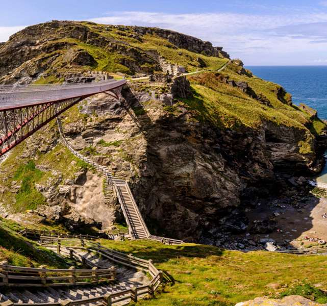

​​King Arthur of Camelot was conceived by magic with the help of the great wizard, Merlin, at
Tintagel. Or so the legend goes.

The magnetism of Tintagel in the UK’s Cornwall is silently accepted but widely
unacknowledged. Like the pull of the moon controlling our tides and the variances of our
petty little moods, we visit trancelike to experience a moment of revival. People flock to it in
the meandering way we gravitate homewards - knowing that a steadfast welcome awaits us.
Despite the topographic challenge, we wander spellbound around the land, leaving the
crashing to the waves, and not to the zealous, trekking-pole-wielding hikers. 

You hear about Tintagel and are shocked it exists. Prevailing in the space that treads the
fine line between truth and fiction, Tintagel lends reality to what many still speculate may
have been a real person. King Arthur’s legend and the faerie magic tied to lands sparkling
with verdant purity are all experienced in one spot - less the final destination of pilgrimages
and more a spiritual checkpoint for those on their way elsewhere. Tintagel will leave you
enriched, invigorated, better than you were when you arrived. And when you leave that
magic clings to you, lighting you in the days following - a mysterious warm breeze on a
winter evening, being undercharged for your coffee the next morning at the cafe, spotting a
hawk flying over the horizon while everyone else seems to miss its distant keening. 

Tintagel exists. The castle - even in its ruins - exists. And the magic? Well….

Set in an unassuming English village, full of huddled, diminutive houses, the walk to Tintagel
Castle begins modestly enough. With the blasé attitude of any northward traveller traipsing
towards a certain meeting with the Cornish Sea, I set off towards my destination. A wide
footpath stretches before me towards a hilly horizon. A black cat slinks out from between a
fence and leads me along the path, turning to glance back at me as if to ensure that I’m still
following. The path stretches on and I am left looking at a crossroads. The footpath diverges;
right for the cafe, left for the gift shop - the duality of a traveller’s decision - or straight ahead
to Tintagel Castle. I march onward.

From the fifth to seventh century AD Tintagel is believed to have been a thriving trade
settlement as well as a residential dwelling for Cornish kings. By the 1230s, Richard, Earl of
Cornwall had built a castle on the site, lured by whisperings of magical powers and mythical
beings on the land. It’s not difficult to see why. It’s as if the civilization that once teemed here
now pulsates within the crashing waves, imbuing them with sentience, the ancient grassy
hill’s memories we can only guess at.

Tintagel Castle is in ruins. What was once the home of rulers is now the toppled remnant of
a township that prospered there. I look around at what once was a grand entrance,
someone’s bedroom, a kitchen. The ocean is as all-embracing from the castle’s window as it
is from the new footbridge which joins two halves of the ruins between the mainland and the
island. It is a more sturdy affair than its counterpart which stood over 500 years ago. 

Closer to sea level, Merlin’s Cave is a grotto that is visible from the path to the ruins at
Tintagel and is accessible at low tide. Vertiginous walkways make it simpler for visitors to
traverse the landscape with relative ease. The stories of old say that Merlin resided in this
cave. Today, it is adorned with an impressive relief carving by Peter Graham; a wisened
visage lends to the drama of the sight, reminding backpack-slinging tourists of the power
that mythology has to shape history.

I climb more than a hundred steps to get to the top of a ruin that once served as a courtyard.
It’s a wide open space that boasts a 360 degree view of the impressive site - a welcome
exchange for an impromptu cardiovascular workout. I glance over the edge, forgetting
gravity for a moment as I view the lumpy hills and the slanting pathways which transect the
landscape in every which way. The people are ants in this basin of topography.
 

My usual frustration at not being able to see through the mystery of historical sites hasn’t
bothered me here. Maybe it’s the enormity of the surrounding landscape; the voracious,
devastating sea or the way the sunlight dances off the stone walls, but I feel close to the
people who centuries prior lived their lives in this spot.   

I make my way back towards the path but not before heading towards a cloaked figure
standing on the rugged promontory. He stands at 8 feet tall, clasping an imposing sword, his
head bent in penance to Gallos - the Cornish word for ‘power’ that the bronze statue is
named for. A crown sits on his hooded head. He is King Arthur, as imagined by artist Rubin
Eynon. Richard of Cornwall made it trendy, but the modern Cornish have continued to make
their mark on the dramatic landscape of Tintagel, a reminder of the enduring power of
legend.

Standing three metres out from the cliff edge I can see the waves crashing against the rocks
below, sharpening them into jagged shards. The compulsion of the strong wind whips my
hair into a mess. I take about five steps back to the middle of the cliff where I sit on an
overturned rock. Families with children are standing around and posing with the statue. I
notice suddenly that the air doesn’t even stir, as if by magic. In fact, it’s warm. I shed two
layers of jackets and settle further into the rock. Whether King Arthur or Merlin lived or not is
unimportant. Here, they are real. 

Tintagel Castle enjoyed a fleeting lifetime. When the fault line it was built upon began to
shift, the castle was torn in half and suffered premature erosion. But it has prevailed as a
marker of the human need to link legend with location; to trace a state of mind born of myth
to a landmark.

As I walk back towards Tintagel village the concrete path reminds me that I am returning to
the present day, having lived my Arthurian moment. Behind me, the landscape sighs with
expectation.